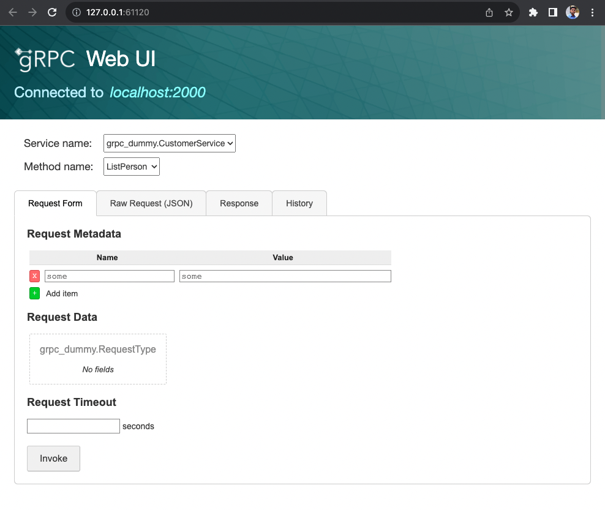

# gRPC dummy

A Go project that serves as an example of a gRPC-based application. It includes a Dockerfile and a Makefile for building, testing, and running the application inside a Docker container.


## Build the Application

To build the gRPC application, run:

```sh
make build
```

### Clean Build Artifacts

To clean build artifacts, run:

```sh
make clean
```

### Run Tests

```sh
make test
```

### Install Dependencies

```sh
make get
```


## Build Docker Image

To build a Docker image from the project, run:

```sh
make docker-build
```

### Push Docker Image

To tag the Docker image and push it to a Docker registry, you need to run:

```sh
make docker-push
```

## Run the Application

To run the application, you need to run:

```sh
SERVER_PORT=8080 ./grpc-dummy
```

Use [grpc-ui](https://github.com/fullstorydev/grpcui) to connect to the application

```sh
$: grpcui --plaintext localhost:8080
gRPC Web UI available at http://127.0.0.1:61120/
```

Access the application on http://127.0.0.1:61120/ , you will see




## Deploy on K8s Environment

```sh
kubectl apply -f k8s/deployment.yaml
```

Use kubectl port forward

```sh
kubectl port-forward svc/grpc-dummy -n default 8080:8080

Forwarding from 127.0.0.1:8080 -> 8080
Forwarding from [::1]:8080 -> 8080
```

User [grpc-ui](https://github.com/fullstorydev/grpcui) to connect

```sh
grpcui --plaintext localhost:8080

gRPC Web UI available at http://127.0.0.1:62290/
```
## Development
### Pre-requisite

#### Protocol buffer installation
```
$: brew install protobuf
$: protoc --version  # Ensure compiler version is 3+
```

## Server

### go

Generate a server interface

```
$: protoc --go_out=. --go-grpc_opt=require_unimplemented_servers=false --go-grpc_out=. proto/customer_service.proto
```

Start Server

```
$ SERVER_PORT=8080 go run server/go/server.go
```

## Client

### grpcui

```
$: grpcui --plaintext localhost:8080
gRPC Web UI available at http://127.0.0.1:51685/
```
